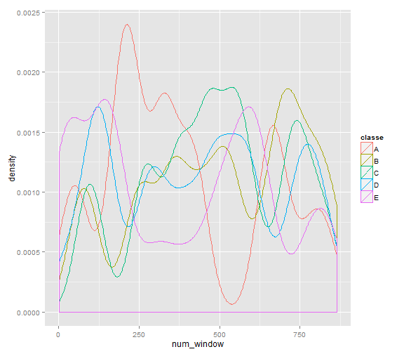

# Activity quality prediction - ML algorithm

**Overview** : The aim of the analysis is to predict the quality of activity performed. For this data from accelerometers on the belt, forearm, arm, and dumbell of 6 participants was collected. They were asked to perform barbell lifts correctly and incorrectly in 5 different ways. The data (source: http://groupware.les.inf.puc-rio.br/har) contains various measurements from which we have to build the machine learning algorithm.

## Question
Given a set of features we have to determine the manner in which activity was performed.

## Input data
The data was obtained from http://groupware.les.inf.puc-rio.br/har in two sets.
Data for training contained 19622 observations.
We have to build and test our algorithm on this dataset. column classe in the dataset is the one we have to predict using rest of the 159 columns.
One more dataset, testing was also provided, for which we have to predict the classe. There are only 20 observations in the dataset.

Data and libraries were loaded into R


```r
library(caret)
library(xtable)
library(ggplot2)
training <- read.csv("pml-training.csv")
testing <- read.csv("pml-testing.csv")
```

## Features
For each observation, there are 160 variables, out of which one is classe, which we have to predict. We can use rest of the 159 features. 
We have to identify the features which we might eliminate while fitting the model.
there are two kinds of features which we want to eliminate.
* Features which have values missing for all the observations.
* Features which do not have any relation with classe.

Our aim in the analysis is to determine classe for the 20 observations in dataset testing. Hence features which have missing values for all the observations were identified and removed from each dataset.
After removing such features it was observed that no other feature in either of the dataset had missing value for any of the observations, so no imputation needed.

Next,varaibles such as serial number, date and time stamps were removed as there is no reason why they should have any predictive power.

Following functions were used in subsequent code.

```r
booleanToInt <- function(value)
{
	value*1
}

zeroOrNot <- function(value)
{
	if(value==0)
	{
		0
	} else {
		1
	}
}
```

Final set of features was selected using the code below.

```r
featureNames <- names(training)

k <- data.frame(sapply(training, FUN=is.na))
k <- data.frame(sapply(k,FUN=booleanToInt))
k <- data.frame(sapply(k,FUN=sum))
names(k) <- "isNA"
cn <- rep(NA,dim(training)[2])
for(i in 1:dim(training)[2])
{
	cn[i] <- if(k$isNA[i]!=0) { 1 } else { 0 }
}

cn2 <- rep(NA,dim(training)[2])
for(i in 1:dim(training)[2])
{
	cn2[i] <- i*(1-cn[i])
}

cn2 <- cn2[cn2>0]

cn2 <- setdiff(cn2,c(1,3,4,5))

training <- training[cn2]
testing <- testing[cn2]

k <- data.frame(sapply(testing, FUN=is.na))
k <- data.frame(sapply(k,FUN=booleanToInt))
k <- data.frame(sapply(k,FUN=sum))
names(k) <- "isNA"
cn <- rep(NA,dim(testing)[2])
for(i in 1:dim(testing)[2])
{
	cn[i] <- if(k$isNA[i]!=0) { 1 } else { 0 }
}

cn2 <- rep(NA,dim(testing)[2])
for(i in 1:dim(testing)[2])
{
	cn2[i] <- i*(1-cn[i])
}

cn2 <- cn2[cn2>0]

training <- training[cn2]
testing <- testing[cn2]
```

We were left with a set of 55 features which we could use to build the algorithm.
Since classification models were to be fit, PCA was not used to pre-process the features. Also features were not normalized for the same reason.


## Algorithm
Since the variable we need to predict is not numeric, we need classification techniques.
Random forest has been used here.
For this first trainData was split in two different segments, namely
* train
* test

The random forest model needs to be fit on train data set and validated on test dataset.
Since we have to run the model multiple times, so as to pick the best performing model, we can't use whole train data to fit the model and test the performance on test dataset.
Hence for cross validation I have used the following strategy.

Cross-validation technique used: **Random subsampling**

train dataset was split in train and test 3 times, i.e.
* train1 and test1
* train2 and test2
* train3 and test3


```r
set.seed(1702)
inTrain = createDataPartition(training$classe, p = 0.6)[[1]]
train = training[inTrain,]
test = training[-inTrain,]

set.seed(32000)
seeds <- round((10000*rnorm(5,mean=100,sd=10)^2)^0.5)

set.seed(seeds[1])
inTrain1 = createDataPartition(train$classe, p = 0.6)[[1]]
set.seed(seeds[2])
inTrain2 = createDataPartition(train$classe, p = 0.6)[[1]]
set.seed(seeds[3])
inTrain3 = createDataPartition(train$classe, p = 0.6)[[1]]

train1 = train[inTrain1,]
test1 = train[-inTrain1,]
train2 = train[inTrain2,]
test2 = train[-inTrain2,]
train3 = train[inTrain3,]
test3 = train[-inTrain3,]
```

### Feature plots
We are building a machine learning algorithm, hence interpretability is not as much important here. Still we would look at plots of some of the features. (on training data, keeping testing data aside)


```r
qplot(train[,3],colour=classe, data=train, geom="density", xlab=names(train)[3])
```

 


```r
qplot(train[,17],colour=classe, data=train, geom="density", xlab=names(train)[17])
```

 


```r
qplot(train[,20],colour=classe, data=train, geom="density", xlab=names(train)[20])
```

 


```r
qplot(train[,24],colour=classe, data=train, geom="density", xlab=names(train)[24])
```

 

We can see that there is slight difference among distributon of feature values across different classe. We expect our machine learning technique to identify all such subtle differences and predict the outcome accurately.


## Cross validation - Picking up best performing model

Each time a random forest model was fit on training dataset and accuracy was determined on paired testing dataset.
The model with best accuracy would be used as the FinalModel.
We would validate the final model on our test dataset(splitted from training itself) to get an idea of the out of sample error-rate. we would do this only once, at the end.
In the end we would use this final model to predict classe of our validation("testing") dataset.


```r
modelFit1 <- train(classe~.,data=train1, method="rf")
modelFit2 <- train(classe~.,data=train2, method="rf")
modelFit3 <- train(classe~.,data=train3, method="rf")
```
After fitting, each model was validated on corresponding test dataset.
Overall summary of Confusion Matrix of each model helped in determining the best performing model out of the 3 models.


```r
test1$pred=predict(modelFit1, test1)
test2$pred=predict(modelFit2, test2)
test3$pred=predict(modelFit3, test3)

test1Results <- confusionMatrix(test1$pred,test1$classe)$overall
test2Results <- confusionMatrix(test2$pred,test2$classe)$overall
test3Results <- confusionMatrix(test3$pred,test3$classe)$overall

testResults <- rbind(test1Results,test2Results,test3Results)
testResults <- data.frame(testResults)

modelFit2Accuracy <- round(testResults$Accuracy[2]*100,2)

testResults <- xtable(data.frame(testResults))
print(testResults,type="html")
```

<!-- html table generated in R 3.0.2 by xtable 1.7-4 package -->
<!-- Wed May 20 15:26:51 2015 -->
<table border=1>
<tr> <th>  </th> <th> Accuracy </th> <th> Kappa </th> <th> AccuracyLower </th> <th> AccuracyUpper </th> <th> AccuracyNull </th> <th> AccuracyPValue </th> <th> McnemarPValue </th>  </tr>
  <tr> <td align="right"> test1Results </td> <td align="right"> 0.99 </td> <td align="right"> 0.99 </td> <td align="right"> 0.99 </td> <td align="right"> 0.99 </td> <td align="right"> 0.28 </td> <td align="right"> 0.00 </td> <td align="right">  </td> </tr>
  <tr> <td align="right"> test2Results </td> <td align="right"> 1.00 </td> <td align="right"> 0.99 </td> <td align="right"> 0.99 </td> <td align="right"> 1.00 </td> <td align="right"> 0.28 </td> <td align="right"> 0.00 </td> <td align="right">  </td> </tr>
  <tr> <td align="right"> test3Results </td> <td align="right"> 0.99 </td> <td align="right"> 0.99 </td> <td align="right"> 0.99 </td> <td align="right"> 1.00 </td> <td align="right"> 0.28 </td> <td align="right"> 0.00 </td> <td align="right">  </td> </tr>
   </table>

As we can see that **modelFit2** has best accuracy of **99.51 %**. Although there is not huge difference between the accuracy of different models, we would still go forward with the best among the 3 models and store it in the variable modelFitFinal.
modelFitFinal is then validated on our test dataset(splitted from training itself), which we haven't used yet in any predictions.
Overall summary of Confusion Matrix of final model on test dataset gives us the estimate of out of sample error rates, which is **2-accuracy.**


```r
modelFitFinal <- modelFit2
test$pred=predict(modelFitFinal, test)
maintestingResults <- confusionMatrix(test$pred,test$classe)$overall
errorRate <- round((1 - maintestingResults[1])*100,2)
maintestingResults <- xtable(data.frame(maintestingResults))
Predictiontable <- xtable(table(test$pred,test$classe))
print(maintestingResults,type="html")
```

<!-- html table generated in R 3.0.2 by xtable 1.7-4 package -->
<!-- Wed May 20 15:26:51 2015 -->
<table border=1>
<tr> <th>  </th> <th> maintestingResults </th>  </tr>
  <tr> <td align="right"> Accuracy </td> <td align="right"> 0.99 </td> </tr>
  <tr> <td align="right"> Kappa </td> <td align="right"> 0.99 </td> </tr>
  <tr> <td align="right"> AccuracyLower </td> <td align="right"> 0.99 </td> </tr>
  <tr> <td align="right"> AccuracyUpper </td> <td align="right"> 0.99 </td> </tr>
  <tr> <td align="right"> AccuracyNull </td> <td align="right"> 0.28 </td> </tr>
  <tr> <td align="right"> AccuracyPValue </td> <td align="right"> 0.00 </td> </tr>
  <tr> <td align="right"> McnemarPValue </td> <td align="right">  </td> </tr>
   </table>

```r
print(Predictiontable,type="html")
```

<!-- html table generated in R 3.0.2 by xtable 1.7-4 package -->
<!-- Wed May 20 15:26:51 2015 -->
<table border=1>
<tr> <th>  </th> <th> A </th> <th> B </th> <th> C </th> <th> D </th> <th> E </th>  </tr>
  <tr> <td align="right"> A </td> <td align="right"> 2232 </td> <td align="right">   8 </td> <td align="right">   0 </td> <td align="right">   0 </td> <td align="right">   0 </td> </tr>
  <tr> <td align="right"> B </td> <td align="right">   0 </td> <td align="right"> 1503 </td> <td align="right">  21 </td> <td align="right">   0 </td> <td align="right">   1 </td> </tr>
  <tr> <td align="right"> C </td> <td align="right">   0 </td> <td align="right">   7 </td> <td align="right"> 1346 </td> <td align="right">   9 </td> <td align="right">   0 </td> </tr>
  <tr> <td align="right"> D </td> <td align="right">   0 </td> <td align="right">   0 </td> <td align="right">   1 </td> <td align="right"> 1276 </td> <td align="right">   8 </td> </tr>
  <tr> <td align="right"> E </td> <td align="right">   0 </td> <td align="right">   0 </td> <td align="right">   0 </td> <td align="right">   1 </td> <td align="right"> 1433 </td> </tr>
   </table>
## Out of sample error rate estimation
Out of sample error rate of the final model is **0.71 %.**
Following is the plot of classe v/s prediction on testing dataset.


```r
plot(test$pred,test$classe, xlab="predictions",ylab="actual", col=c("red","blue","green","gray","yellow"))
```

 

# Prediction

Finally we predict the activity of the validation("testing") dataset.


```r
testing$pred=predict(modelFitFinal, testing)
validationResult <- xtable(testing[,56:57])
print(validationResult,type="html")
```

<!-- html table generated in R 3.0.2 by xtable 1.7-4 package -->
<!-- Wed May 20 15:26:51 2015 -->
<table border=1>
<tr> <th>  </th> <th> problem_id </th> <th> pred </th>  </tr>
  <tr> <td align="right"> 1 </td> <td align="right">   1 </td> <td> B </td> </tr>
  <tr> <td align="right"> 2 </td> <td align="right">   2 </td> <td> A </td> </tr>
  <tr> <td align="right"> 3 </td> <td align="right">   3 </td> <td> B </td> </tr>
  <tr> <td align="right"> 4 </td> <td align="right">   4 </td> <td> A </td> </tr>
  <tr> <td align="right"> 5 </td> <td align="right">   5 </td> <td> A </td> </tr>
  <tr> <td align="right"> 6 </td> <td align="right">   6 </td> <td> E </td> </tr>
  <tr> <td align="right"> 7 </td> <td align="right">   7 </td> <td> D </td> </tr>
  <tr> <td align="right"> 8 </td> <td align="right">   8 </td> <td> B </td> </tr>
  <tr> <td align="right"> 9 </td> <td align="right">   9 </td> <td> A </td> </tr>
  <tr> <td align="right"> 10 </td> <td align="right">  10 </td> <td> A </td> </tr>
  <tr> <td align="right"> 11 </td> <td align="right">  11 </td> <td> B </td> </tr>
  <tr> <td align="right"> 12 </td> <td align="right">  12 </td> <td> C </td> </tr>
  <tr> <td align="right"> 13 </td> <td align="right">  13 </td> <td> B </td> </tr>
  <tr> <td align="right"> 14 </td> <td align="right">  14 </td> <td> A </td> </tr>
  <tr> <td align="right"> 15 </td> <td align="right">  15 </td> <td> E </td> </tr>
  <tr> <td align="right"> 16 </td> <td align="right">  16 </td> <td> E </td> </tr>
  <tr> <td align="right"> 17 </td> <td align="right">  17 </td> <td> A </td> </tr>
  <tr> <td align="right"> 18 </td> <td align="right">  18 </td> <td> B </td> </tr>
  <tr> <td align="right"> 19 </td> <td align="right">  19 </td> <td> B </td> </tr>
  <tr> <td align="right"> 20 </td> <td align="right">  20 </td> <td> B </td> </tr>
   </table>

